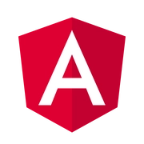

# Hi there!  I'm Gouranga Das Samrat

  

##  About Me

- 🏦 Professional Full Stack Developer based in Bangladesh
- 📝 Regular technical writer on **[Dev.to](https://dev.to/gouranga-das-khulna/)**
- 📫 Contact me: **gouranga.das.khulna@gmail.com**
- 💬 Ask me about Web Development and Web Design
- ⚡ Fun fact: I dream of traveling to Switzerland

## 🌐 Connect With Me

  
  
  
  
  
  
  
  
  
  
  
  
  

## 💻 Tech Stack

  <table>
    <thead>
      <tr>
        <th>Programming Languages</th>
        <th>Frontend</th>
        <th>Backend</th>
        <th>Database</th>
        <th>DevOps</th>
        <th>Tools</th>
      </tr>
    </thead>
    <tbody>
      <tr>
        <td align="center">
           
          JavaScript
        </td>
        <td align="center">
           
          React
        </td>
        <td align="center">
           
          Node.js
        </td>
        <td align="center">
           
          MongoDB
        </td>
        <td align="center">
           
          Docker
        </td>
        <td align="center">
           
          Git
        </td>
      </tr>
      <tr>
        <td align="center">
           
          TypeScript
        </td>
        <td align="center">
           
          Next.js
        </td>
        <td align="center">
           
          Express.js
        </td>
        <td align="center">
           
          MySQL
        </td>
        <td align="center">
           
          Linux
        </td>
        <td align="center">
           
          GitHub
        </td>
      </tr>
      <tr>
        <td align="center">
           
          C++
        </td>
        <td align="center">
           
          Tailwind
        </td>
        <td align="center">-</td>
        <td align="center">
           
          Firebase
        </td>
        <td align="center">
           
          Actions
        </td>
        <td align="center">
           
          Figma
        </td>
      </tr>
      <tr>
        <td align="center">-</td>
        <td align="center">
           
          Bootstrap
        </td>
        <td align="center">-</td>
        <td align="center">-</td>
        <td align="center">-</td>
        <td align="center">
           
          Postman
        </td>
      </tr>
    </tbody>
  </table>

## ✍️ Dev Community Badges

  
  
  

## 📊 GitHub Statistics

  
   
  
   
  

## ✍️ Random Dev Quote

  

## 🐍 Contribution Graph

  <picture>
  <source media="(prefers-color-scheme: dark)" srcset="https://raw.githubusercontent.com/GourangaDasSamrat/GourangaDasSamrat/output/github-snake-dark.svg" />
  <source media="(prefers-color-scheme: light)" srcset="https://raw.githubusercontent.com/GourangaDasSamrat/GourangaDasSamrat/output/github-snake.svg" />
  
</picture>

---

  
Made with  by Gouranga Das Samrat

  

    
  

