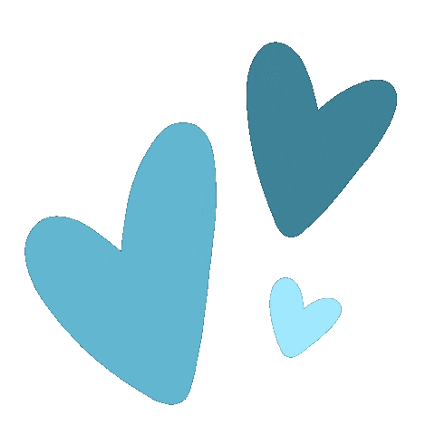

# Hi there!  I'm Gouranga Das Samrat

  

##  About Me

- 🏦 Software Engineer specializing in system design and devops.
- 💼 Building production-ready solutions with focus on performance, maintainability & user experience
- 📝 Technical writer on **[Dev.to](https://dev.to/gouranga-das-khulna/)** sharing modern web development insights
- 🧪 Maintains public learning archives (`*-labs`) to document long-term growth and experimentation
- 👇 Check out my **pinned repositories** below for featured projects
- 📫 Reach me at: **gouranga.samrat@gmail.com**
- ⚡ Fun fact: **I dream to climb Mount Fuji** 🗻
    
## 🌐 Connect With Me

  
  
  
  
  
  
  
  
  
  
  
  

## 🛠️ Tech Stacks

  <table>
    <tr>
      <td align="center" width="150"><strong>Languages</strong></td>
      <td>JavaScript • TypeScript • Go • C++ • C • Python</td>
    </tr>
    <tr>
      <td align="center"><strong>Frontend</strong></td>
      <td>React • Next.js • Redux • TanStack Query • Tailwind CSS • Bootstrap</td>
    </tr>
    <tr>
      <td align="center"><strong>Backend</strong></td>
      <td>Node.js • Express • Flask • REST APIs</td>
    </tr>
    <tr>
      <td align="center"><strong>Database</strong></td>
      <td>MongoDB • PostgreSQL • Firebase • Prisma(ORM)</td>
    </tr>
    <tr>
      <td align="center"><strong>DevOps & Cloud</strong></td>
      <td>Docker • Linux • GitHub Actions • CI/CD</td>
    </tr>
    <tr>
      <td align="center"><strong>Documentation</strong></td>
      <td>Markdown • Mermaid • LaTeX</td>
    </tr>
    <tr>
      <td align="center"><strong>Tools & Editors</strong></td>
      <td>Git • GitHub • Postman • Neovim • VS Code</td>
    </tr>
    <tr>
      <td align="center"><strong>Design</strong></td>
      <td>Figma</td>
    </tr>
  </table>

  <em>I focus on fundamentals, trade-offs, and long-term maintainability rather than tool memorization.</em> 
  <em>Open to challenging projects that push technical boundaries and deliver real user value.</em>

## 📊 GitHub Statistics

  <picture>
  <source
    srcset="https://github-readme-stats-delta-six-92.vercel.app/api?username=GourangaDasSamrat&show_icons=true&theme=dracula"
    media="(prefers-color-scheme: dark)"
  />
  <source
    srcset="https://github-readme-stats-delta-six-92.vercel.app/api?username=GourangaDasSamrat&show_icons=true"
    media="(prefers-color-scheme: light), (prefers-color-scheme: no-preference)"
  />
  
</picture>

<picture>
  <source
    srcset="https://github-readme-streak-stats-wine-phi.vercel.app/?user=GourangaDasSamrat&theme=dracula&hide_border=false"
    media="(prefers-color-scheme: dark)"
  />
  <source
    srcset="https://github-readme-streak-stats-wine-phi.vercel.app/?user=GourangaDasSamrat&hide_border=false"
    media="(prefers-color-scheme: light), (prefers-color-scheme: no-preference)"
  />
  
</picture>

<picture>
  <source
    srcset="https://github-readme-stats-delta-six-92.vercel.app/api/top-langs/?username=GourangaDasSamrat&layout=pie&theme=dracula"
    media="(prefers-color-scheme: dark)"
  />
  <source
    srcset="https://github-readme-stats-delta-six-92.vercel.app/api/top-langs/?username=GourangaDasSamrat&layout=pie"
    media="(prefers-color-scheme: light), (prefers-color-scheme: no-preference)"
  />
  
</picture>

## 🐍 Contribution Graph

  <picture>
    <source media="(prefers-color-scheme: dark)" srcset="https://raw.githubusercontent.com/GourangaDasSamrat/GourangaDasSamrat/output/github-snake-dark.svg" />
    <source media="(prefers-color-scheme: light)" srcset="https://raw.githubusercontent.com/GourangaDasSamrat/GourangaDasSamrat/output/github-snake.svg" />
    
  </picture>

---

  
Made with  by Gouranga Das Samrat

  

    
  

